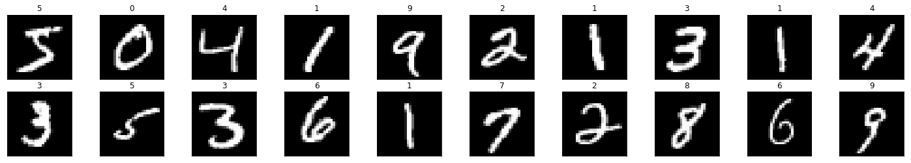
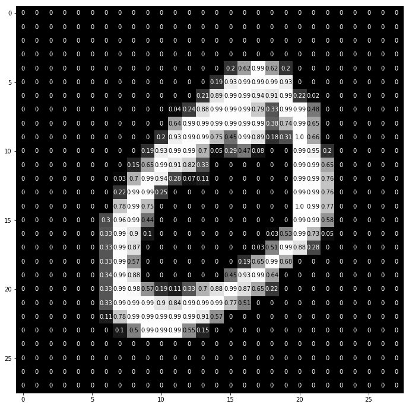

# MNIST Using MLP in Pytorch
 > Python 3.6, Pytorch, Cuda
 
O conjunto de dados MNIST é composto por imagens de digitos escritos a mão. Contem um total de 
60.000 imagens para treinamento e outras 10.000 imagens para teste.

## Imagens
Todas as imagens possuem o mesmo tamanho, 28x28 pixels e estão em tons de cinza.
Abaixo algumas imagens exemplo que podemos encontrar no conjunto de dados de treinamento.

   

Mostrando uma imagem exemplo como matrix podemos analisar o valor dos pixels ja 
normalizados.

   

## Redes Multiplayer Perceptron

As Redes Perceptron Multicamadas (Multilayer Perceptron - MLP), são redes do tipo feedforward 
caracterizadas por conter uma ou mais camadas intermediárias, ou também chamadas de camadas 
escondidas (hidden layers), situadas entre a camada de entrada e a respectiva camada neural de 
saída.
